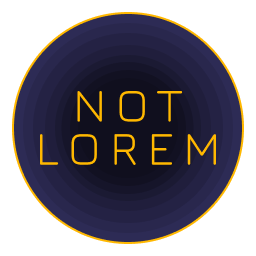

# Not Lorem

## It is a Text Generator Extension For Visual Studio Code

Api used <http://asdfast.beobit.net/>

This extension I've made during learning how to make extensions for VSCode

## Usage

1 - After Installing the extension,Open Command Pallet(`Ctrl + Shift + P`)

2 - Search for 'Search Words' or 'Search Paras'`

3 - Enter The Number of word or paragraphs

3 - The Extension will automatically search for words and paste them at the place of your cursor.

---

## Repository & Feedback

Please report issues related to this theme on the repository page.

[GitHub Repository](https://github.com/kushagra-aa/not-lorem)

## Developer Information

Kushagra Agnihotri

Please Visit [Here](https://github.com/kushagra-aa/) for additional information

---
Copyright © `Kushagra-AA`
